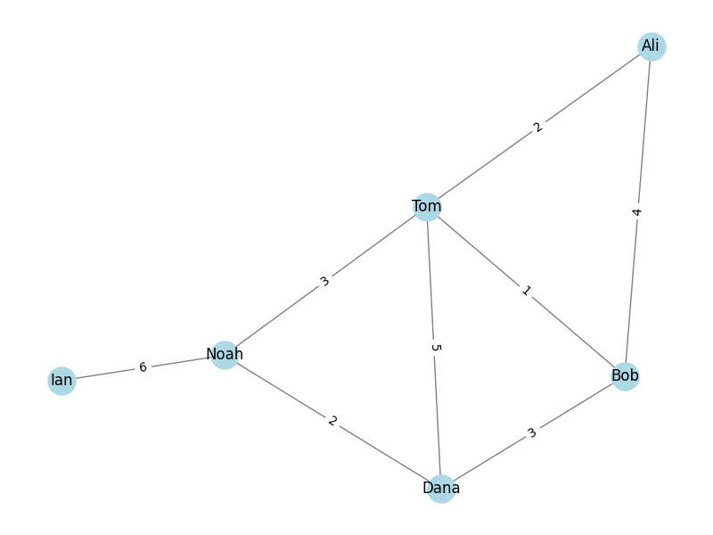

# 06_Graph algorithms

=====================

## Pathfinding Dijkstra Algorithm in a Social Network

---

This project uses Dijkstra algorithm to compute the shortest paths and lengths.

### Graph Visualization

The graph is visualized using **matplotlib** to show the connections among individuals.

### Graph Output

- **Shortest paths and lengths between all pairs of nodes:**

Ali to Bob: Path = ['Ali', 'Tom', 'Bob'], Length = 3
Ali to Tom: Path = ['Ali', 'Tom'], Length = 2
Ali to Dana: Path = ['Ali', 'Tom', 'Bob', 'Dana'], Length = 6
Ali to Noah: Path = ['Ali', 'Tom', 'Noah'], Length = 5
Ali to Ian: Path = ['Ali', 'Tom', 'Noah', 'Ian'], Length = 11
Bob to Tom: Path = ['Bob', 'Tom'], Length = 1
Bob to Dana: Path = ['Bob', 'Dana'], Length = 3
Bob to Noah: Path = ['Bob', 'Tom', 'Noah'], Length = 4
Bob to Ian: Path = ['Bob', 'Tom', 'Noah', 'Ian'], Length = 10
Tom to Dana: Path = ['Tom', 'Bob', 'Dana'], Length = 4
Tom to Noah: Path = ['Tom', 'Noah'], Length = 3
Tom to Ian: Path = ['Tom', 'Noah', 'Ian'], Length = 9
Dana to Noah: Path = ['Dana', 'Noah'], Length = 2
Dana to Ian: Path = ['Dana', 'Noah', 'Ian'], Length = 8
Noah to Ian: Path = ['Noah', 'Ian'], Length = 6
