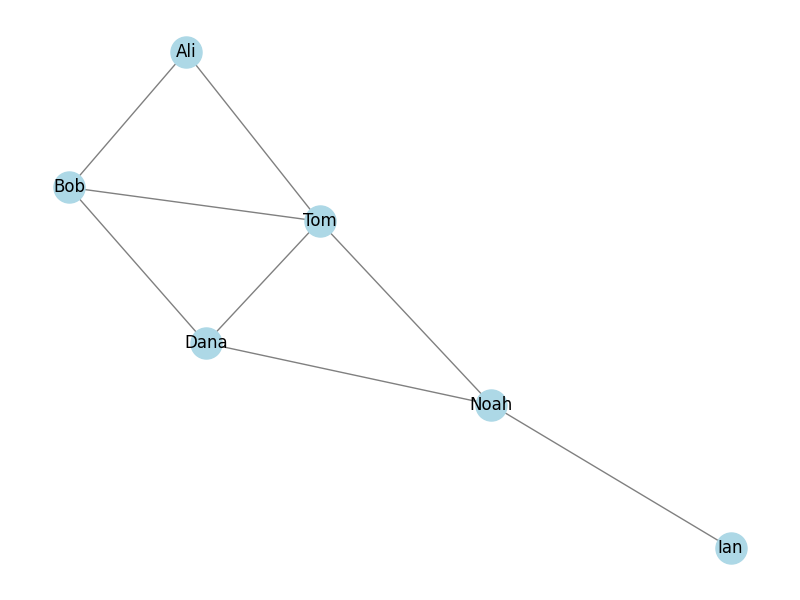

# 06_Graph algorithms

=====================

## Social Network Graph Analysis

This project utilizes the networkx library to create and analyze a simple undirected graph representing a social network. Below are the main characteristics of the graph.

### Characteristics

- **Number of Nodes:** The graph contains a total of 6 nodes, representing individuals:
  Ali
  Bob
  Tom
  Dana
  Noah
  Ian
- **Number of Edges:** There are 8 edges in the graph, indicating the friendships between the individuals.
  Degree of Each Node:
  Ali: 2
  Bob: 3
  Tom: 4
  Dana: 3
  Noah: 3
  Ian: 1
  The degree of a node represents the number of connections (edges) it has with other nodes.

### Graph Visualization

The graph is visualized using matplotlib, providing a clear representation of the social network and the relationships among individuals.

### Usage

To run this analysis, ensure you have the required libraries installed:

- **pip install networkx matplotlib**

### Conclusion

This analysis provides insights into the structure of the social network, highlighting the connectivity and relationships among the individuals involved.
