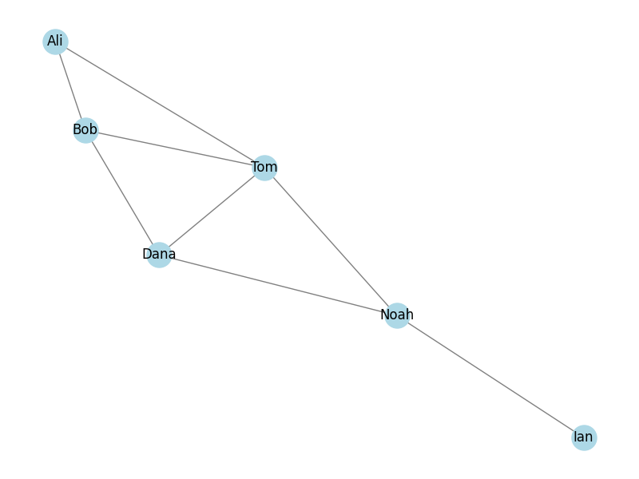

# 06_Graph algorithms

=====================

## Pathfinding Algorithms in a Social Network

---

This project compares two algorithms, Depth-First Search (DFS) and Breadth-First Search (BFS), to find a path in a social network graph created with the **networkX** library.

### Graph Overview

- **People:** The graph has 6 nodes representing individuals:

  Ali
  Bob
  Tom
  Dana
  Noah
  Ian

- **Friendships:** There are 8 edges showing how these individuals are connected.

### Algorithms

Two ways implemented to find a path from Ali to Ian:

### Depth-First Search (DFS)

DFS goes deep into the graph first, exploring one path fully before backtracking.
Path Found: ['Ali', 'Tom', 'Dana', 'Noah', 'Ian']

### Breadth-First Search (BFS)

BFS explores all neighbors at the current level before moving deeper.
Path Found: ['Ali', 'Tom', 'Noah', 'Ian']

### Key Differences

DFS takes a longer route through Dana to reach Ian.
BFS finds a shorter path directly via Noah.

### Conclusion

DFS can be longer because it explores deeply.
BFS is often quicker for finding the shortest path in simple graphs.

### Visualization

The graph is visualized using **matplotlib** to show the connections among individuals.
